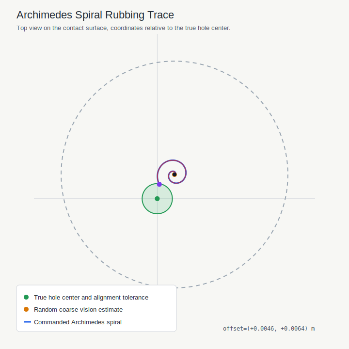

# Peg-in-Hole Paper Algorithm Reproduction Report

- Reference paper: `Compliance-Based Robotic Peg-in-Hole Assembly Strategy Without Force Feedback`
- Reproduction level: `algorithm-level simulation`
- Final state: `COMPLETE`
- Result: **PASSED**
- Failure reason: `none`
- Simulated vision offset mode: `random`
- Simulated vision XY offset: `[0.0046 0.0064]` m
- Random offset radius limit: `0.020000` m
- Random seed: `none`
- Spiral search radius: `0.030000` m
- Spiral pitch: `0.003000` m/turn
- Spiral angular speed: `2.000000` rad/s
- Target contact force: `5.000` N
- Velocity/contact threshold: `0.020000` m/s for `0.300` s
- Wiggle amplitude: `0.002000` m
- Screw turns: `3.000`
- Final XY alignment error: `0.002000` m
- Alignment tolerance: `0.004000` m
- Final insertion depth: `0.025115` m
- Required insertion depth: `0.025000` m
- Max search radius used: `0.004775` m
- CSV log: `peg_in_hole_random_check_log.csv`
- Spiral trace image: `peg_in_hole_random_check_spiral_trace.svg`

## Spiral Trace

## Paper Procedure Mapping

| Paper step | Unit motion represented in this demo |
| --- | --- |
| Reaching | pushing |
| Searching | pushing + rubbing / Archimedes spiral |
| Inserting | pushing + wiggling + screwing |

## Notes

This is an algorithm-level reproduction of the paper workflow.
The simulated vision estimate is the hole pose plus a configurable initial XY offset.
Pushing, rubbing, wiggling, and screwing are represented as task-level motion primitives.
The demo uses deterministic geometric contact cues instead of a full physical contact-state estimator.
It does not reproduce Kinect recognition, torque-level compliant control, or 0.01 mm clearance experiments.